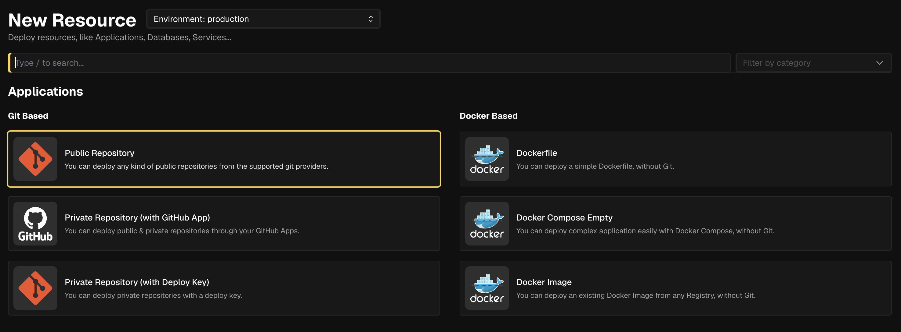
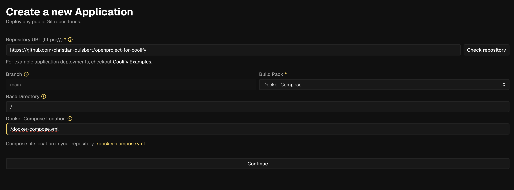
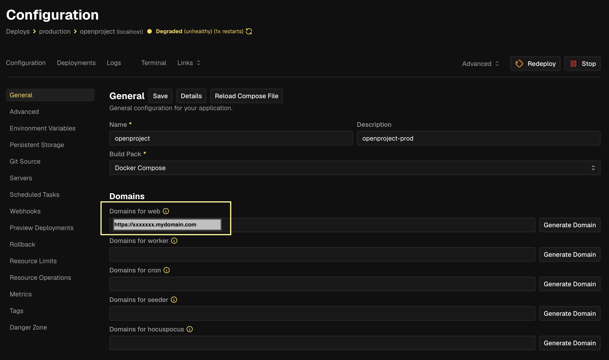
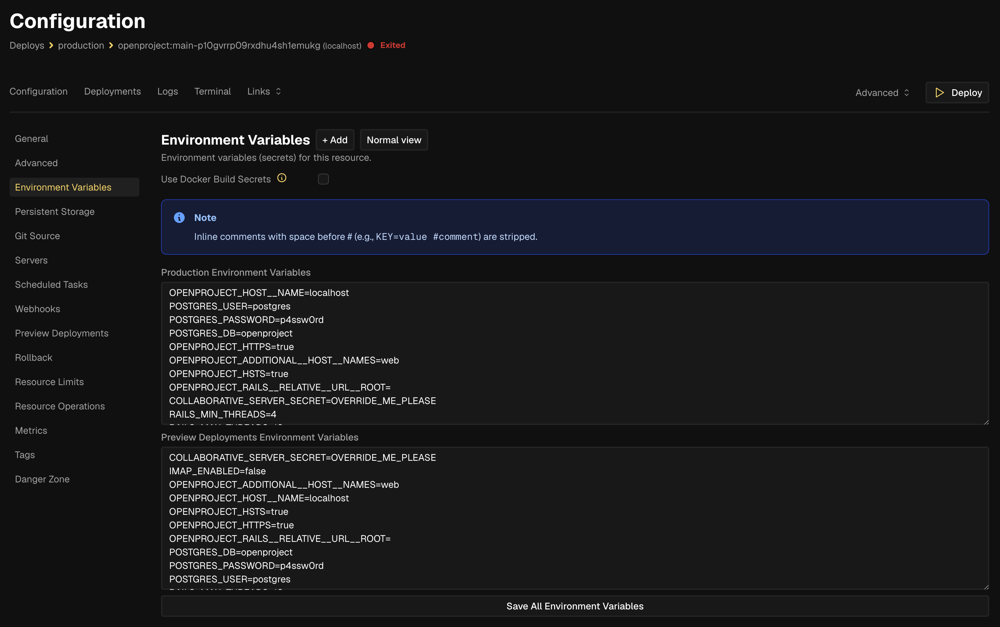

# OpenProject installation with Coolify

This repository contains the installation method for OpenProject using Coolify.

## Quick start (DEPLOY ON COOLIFY)

1. In Coolify: **Project → Resources → [+ New] -> Public Repository**



2. Paste the repository URL: `https://github.com/christian-quisbert/openproject-for-coolify/tree/stable/17`
3. Configure:
   - **Build Pack:** Docker Compose
   - **Base Directory:** `/`
   - **Docker Compose Location:** `/docker-compose.yml`



4. Click **Continue**

5. Set your custom domain



6. **Before deploying**, configure the following environment variables:

| Variable | Value |
|----------|-------|
| `OPENPROJECT_HOST__NAME` | `XXXXXXXXXXX.yourdomain.com` |
| `COLLABORATIVE_SERVER_SECRET` | (generate a key) |
| `POSTGRES_PASSWORD` | (generate a key) |
| `SECRET_KEY_BASE` | (generate a key) |

> To generate keys run: `openssl rand -base64 32 | tr -d '+/=' | cut -c1-32`



7. Save all env variables and click **Deploy**

After deployment, the `seeder` service will show as **exited** — this is normal. It only runs the initial database migrations. Try visiting your domain.

---
### Troubleshooting

**Image pull error on first deploy**

- If the deploy fails because it can't download images from Docker Hub, pre-cache them manually from your server terminal:

```bash
docker pull openproject/openproject:17-slim
docker pull postgres:17
docker pull memcached
docker pull openproject/hocuspocus:17.6.0
```
- Then redeploy from Coolify.


## Quick start (LOCALHOST)

First, you must clone the [openproject-docker-compose](https://github.com/christian-quisbert/openproject-for-coolify.git) repository:

```shell
git clone https://github.com/christian-quisbert/openproject-for-coolify.git
```
Copy the example `docker-compose.override.yml` file.\
Copy the example `.env` file and edit any values you want to change:

```shell
cp docker-compose.override.yml.example docker-compose.override.yml
cp .env.example .env
nano .env
```

If you are using the default value of OPDATA that is used in the ```.env.example``` you need to make sure that the folder exist, and you have the right permissions:

```shell
sudo mkdir -p /var/openproject/assets
sudo chown 1000:1000 -R /var/openproject/assets
```

Next you start up the containers in the background while making sure to pull the latest versions of all used images.

```shell
docker compose up -d --build --pull always
```
After a while, OpenProject should be up and running on `http://localhost:8080`. The default username and password is login: `admin`, and password: `admin`.
The `OPENPROJECT_HTTPS=false` environment variable explicitly disables HTTPS mode for the first startup. Without this, OpenProject assumes it's running behind HTTPS in production by default.


**Para detener los contenedores desplegados localmente:**
```bash
docker compose down
```
> [!NOTE]
> - This will not remove your data which is persisted in named volumes, likely called `assets` (for attachments) and `postgres` (for the database).\
> - If you want to start from scratch and remove the existing data you will have to remove these volumes via `rm -dr data/postgres`.

---
### Customization

The `docker-compose.yml` file present in the repository can be adjusted to your convenience. But note that with each pull, it will be overwritten.
Best practice is to use the file `docker-compose.override.yml` for that case.
For instance you could mount specific configuration files, override environment variables, or switch off services you don't need.

Please refer to the official [Docker Compose documentation](https://docs.docker.com/compose/extends/) for more details.


### Collaboration server

The collaboration server is enabled by default when setting up this application.

> Important! Make sure to override the default secret by adjusting the docker-compose file or setting the `COLLABORATIVE_SERVER_SECRET` variable.


### HTTPS/SSL

On **LOCALHOST**, by default OpenProject starts with the HTTP option **disabled**.


## Image configuration

OpenProject publishes `slim` containers that you should be using for this compose setup.
Please see https://www.openproject.org/docs/installation-and-operations/installation/docker/#available-containers for more information on the containers and versions we push.

## Environment variables Configuration

Environment variables can be added to `docker-compose.yml` under `x-op-app -> environment` to change
OpenProject's configuration. Some are already defined and can be changed via the environment.

You can pass those variables directly when starting the stack as follows.

```
VARIABLE=value docker-compose up -d
```

You can also put those variables into an `.env` file in your current working
directory, and Docker Compose will pick it up automatically. See `.env.example`
for details.


## APP_PORT

If you want to specify a different port, you can do so with:

```
APP_PORT=8080
```

If you don't want OpenProject to bind to `0.0.0.0` you can bind it to localhost only like this:

```
PORT=127.0.0.1:8080
```


## Others:

### TAG
If you want to specify a custom tag for the OpenProject docker image, you can do so with:

```
TAG=my-docker-tag
```

### Upgrade
Retrieve any changes from the `openproject-docker-compose` repository:

    git pull origin stable/17

Build the control plane:

    docker compose -f docker-compose.yml -f docker-compose.control.yml build

Take a backup of your existing postgresql data and openproject assets:

    docker compose -f docker-compose.yml -f docker-compose.control.yml run backup

Run the upgrade:

    docker compose -f docker-compose.yml -f docker-compose.control.yml run upgrade

Relaunch the containers, ensure you are pulling to use the latest version of the Docker images:

    docker compose up -d --build --pull always


### Backup

Switch off your current installation:

    docker compose down

Build the control scripts:

    docker compose -f docker-compose.yml -f docker-compose.control.yml build

Take a backup of your existing PostgreSQL data and OpenProject assets:

    docker compose -f docker-compose.yml -f docker-compose.control.yml run backup

Restart your OpenProject installation

    docker compose up -d

